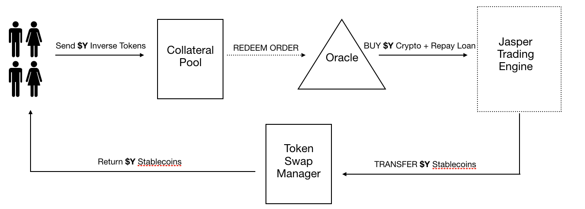

# Setup Instructions

Install Dependencies:

```
npm install
```

Start Local ETH Blockchain:

```
npm run dev
```

Reset contracts (compile, deploy, mint USDC, set data in DB if available)

> TODO: The first run of the script fails. The second succeed. Fix that

```
npm run reset:contracts 0x9e74E6Be10B63A7442184dFFD633fbed80175B34

# npm run reset:contracts <ownerAddress>
# Note that ownerAddress in dev is static at 0x9e74E6Be10B63A7442184dFFD633fbed80175B34
```

### Manual contracts compilation

Compile Contracts

```
npm run compile
```

Deploy Contract

```
npm run deploy
```

Upgrade Contract

```
npm run upgrade
```

### Mint USDC (in development)

```
Run the mintUSDC.js script in the scripts folder (it will mint 10K local mirror of USDC to the first account on ganache on every run)
```

> TODO: add mintInverseToken script instructions

## Interact with remix

### Locally - Flatten contracts (to interact over remix)

- This will create flatten files in flats folder. These can be used in remix to connect to deployed contracts.

```
npm run flatten
```

### On remix

- new solidity file \<contractName>.sol
- copy paste the \<contractName> flat file in remix
- compile using 0.5 compiler
- Find the local \<contractName> address in local /tmp/contractAddresses.json
- Environment: inject web3
- contract deployed at: [previously found address]
- function are now available for interactions

## Test contracts

- These are best structured by mirroring the contracts directory: for each `.sol` file there, create a corresponding `.test.js` file.

```
npm test
```

For more information on testing smart contracts go to [https://docs.openzeppelin.com/learn/writing-automated-tests](https://docs.openzeppelin.com/learn/writing-automated-tests) and [https://docs.openzeppelin.com/test-environment/0.1/api](https://docs.openzeppelin.com/test-environment/0.1/api)

&nbsp;

&nbsp;

# General Dapp Arichitecture

## The Dapp is broken down into 4 components:

- Amun Frontend (UI for KYC, Creation/Redemption, and Token Management)
- Amun Backend (User Database and API Wrapper for Smart Contract Functions)
- Token Swap Smart Contract System (Responsible for Token Swap Management + Portfolio Composition Calcuation)
- Jasper (driven from Onyx system) off-chain Trading Engine (Processes creation, redemption, and rebalance)

## Creation and Redemption

The steps involved in CREATE and REDEEM processes are illustrated below

### CREATE

- KYC’d Authorised User (AU) sends USDC (stablecoin) to the Token collateral pool
- Backend listener is capturing confirmations of that transaction

Once N confirmations reached:

- The backend executes on the trading engine a short-sell
- Once confirmed, a call is made to the CREATE function of the Token Swap Manager (TSM) which mints inverse tokens to the AU's address


### REDEEM

- KYC’d Authorised User (AU) sends inverse tokens to the Token collateral pool
- Backend listener is capturing confirmations of that transaction

Once N confirmations reached:

- The backend executes on the trading engine a long-repay
- Once confirmed, a call is made to the REDEEM function of the Token Swap Manager (TSM) which transfers USDC from the Collateral Pool to the AU and burns the previously sent inverse tokens



## Token rebalance

### Daily Rebalance and Threshold Rebalance

A rebalance will be ordered by the Onyx Trading Engine during two events:

1. 5pm CET during a **Daily Rebalance**
2. A price increase of 33% since the last rebalance, AKA **Threshold Rebalance**

During a rebalance, Jasper Trading Engine engages in one of two actions depending on crypto price:

1. Increase short exposure
2. Decrease short exposure

The rebalance workflow is detailed below:

- Jasper Backend listens for the Time or a Threshold Price to be reached.
- It then reads the Crypto Price from the trading desk and decides to either **increase or decrease short exposure**.
- The trading engine then executing the short-sell / long-repay action
- Once confirmed, a call to the TSM is made to initiates a calculation of the NAV/Cash Position of the Inverse Tokens.

